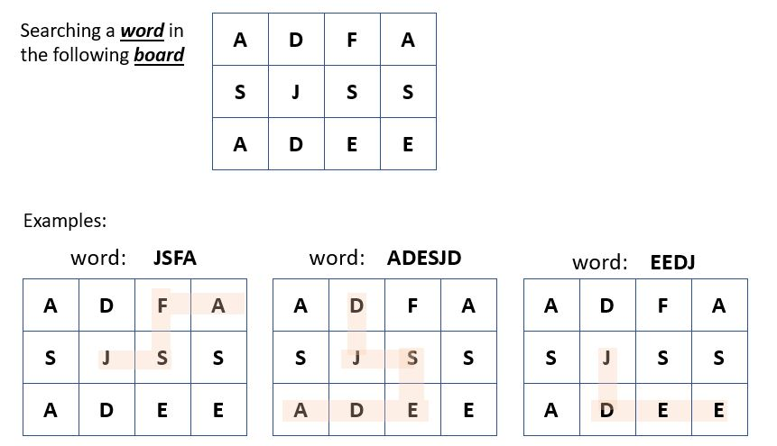

# Search a word

## Description

This program searches a **word** (provided by you) on a given **board** (hardcoded)

## Steps

1) The following graphic depicts how searches are conducted 

   

2) Build the program: Execute **build.bat** to compile and create the executable jar file to test the program

3) Execute the jar file          
   ```bat
   java -jar WordFinder.jar
   ```
   Now provide the words to search


## Other projects:

1) (work-in-progress project) Using Microservices/Docker/Kubernetes - See  [Car Rating project](https://github.com/casalima/CarRatings)
